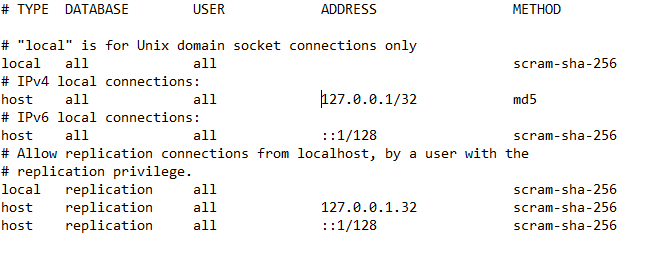

<h1 align = "center"> Analisador X </h1>

 

## Descrição do projeto

Projeto em desenvolvimento como parte do meu portfólio, o foco é no backend e o objetivo é estruturar um forms onde é possível criar um usuário, realizar o login do mesmo e cadastrar informações no banco de dados. 
 Após logar, será possível editar e excluir algumas informações nesse mesmo banco, tudo isso, dentro da temática dos X-Men. 

 

### Funcionalidades

- [x] Cadastro de usuário;
- [x] Tela de login;
- [x] Inclusão de informações no banco de dados;
- [x] Exibir informações do banco de dados;
- [x] Criação de atalho ao instalar;
- [ ] Edição e exclusão de informações do banco de dados.

 

### Pré-requisitos

#### Configurando o banco

Para criação e gerenciamento do banco de dados, será necessário baixar o <a href="https://www.enterprisedb.com/downloads/postgres-postgresql-downloads">postgresql</a> (a versão que está sendo utilizada é a 15.5 do windows). 
 

O posgresql utiliza a porta padrão de número 5432, antes de iniciar a instalação precisamos nos certificar de que ela esteja liberada, para garantir isso, basta ver o seguinte <a href="https://atendimento.nasajon.com.br/nasajon/artigos/c72ad9c3-b08f-4c88-9cc0-c81cad98c373">tutorial</a>.  

Algumas observações baseadas nesse tutorial:
 

- Passo 4: O tipo de conexão é TCP;
- Passo 5: Permitir a conexão;
- Passo 6: A regra se aplica nas 3 opções (Domínio, particular e público);
- Passo 7: Em nome, coloque postgres;
- Após concluir, faça a mesma coisa nas **regras de saída**.

Agora, seguiremos com a instalação, aqui teremos mais um <a href="https://www.w3schools.com/postgresql/postgresql_install.php">passo a passo</a>, depois de concluído, será necessário realizar algumas mudanças no arquivo **pg_hba**, o mesmo, pode ser encontrado (caso o diretório padrão de instalação tenha sido mantido) no caminho: C:\Program Files\PostgreSQL\15\data.

 

Iremos abrir o arquivo com o bloco de notas, ao rolar para baixo, você encontrará algo semelhante a isso:

 

Basta alterar a linha abaixo de IPv4 local connections para que fique igual a seguinte:

#### Criando nosso banco

Finalmente, depois de tantas configurações, vamos para a criação do banco de dados que vamos utilizar. 
Procure pelo atalho do programa **pgAdmin 4** (programa esse, previamente instalado junto com o postgresql).

Assim que abrir, será requisitado que você crie uma senha mestre para poder conectar em seus futuros servidores, eu costumo colocar a mesma senha que foi colocada no ato da instalação do postgresql.

Depois de criar a senha, vamos abrir a aba de servidores e colocar a senha criada:

 

 

Aqui existem duas opções, utilizar a database padrão do pgAdmin ou criar uma nova, caso escolha criar mais uma, clique com o lado direito do mouse em cima de Databases, Create, Database:

 

Escolha o nome de sua preferência, em seguida, lado direito do mouse e escolha Query Tool: 

 

Para recriar o banco de dados utilizado, basta copiar o mesmo do arquivo <a href="https://github.com/Samuel-0liveira/AnalisadorX/blob/master/Banco%20de%20Dados/db_projetox.sql"> db_projetox.sql</a> e executar.

